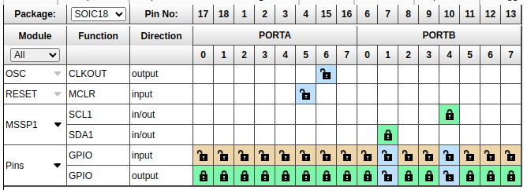
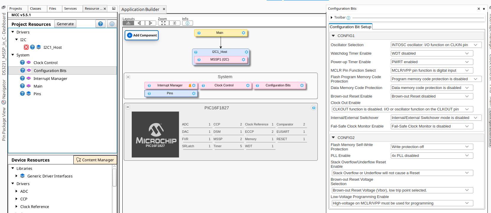

# Leer  DS3231

Este proyecto lee los segundos desde un DS3231 y los presenta por el puerto A del PIC16F1827.

Todo el protocolo I2C esta programado en C con el uso del periferico Master Synchronous Serial Port (MSSP).

## Proyecto

El proyecto se creo con el MPLAB X IDE v6.20 y el compilador XC8 v2.50

## Simulador (No funciona)

El archivo /simulador/ds3231.sim1 se puede abrir con el simulador electronico "SimulIDE" que se puede descargar desde https://simulide.com 

Para este proyecto usamos la version 1.1.0

## PIN Grid View

## Main

## Interrupt Manager

## Configuration Bits

## Clock Control

## I2C1 Host

## MSSP1

